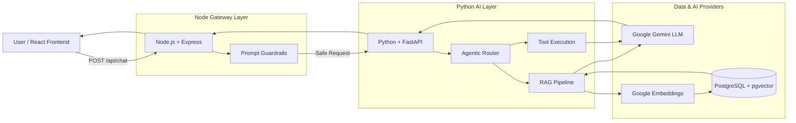

# Cognivault

### AI-Powered Multi-Project Document Analysis Platform

Cognivault is an enterprise-grade Retrieval-Augmented Generation (RAG) platform designed to ingest project documents and provide highly accurate, context-aware answers. By combining modern microservices with Google's Gemini LLM, it completely eliminates the inefficiencies of manual document search while strictly enforcing enterprise security guardrails.

**GitHub Repository**: [https://github.com/nitin-code6/cognivault.git](https://github.com/nitin-code6/cognivault.git)

---

## 2. Table of Contents
- [3. Project Overview](#3-project-overview)
- [4. Problem Statement](#4-problem-statement)
- [5. Solution](#5-solution)
- [6. Project Status](#6-project-status)
- [7. Key Features](#7-key-features)
- [8. Technology Stack](#8-technology-stack)
- [9. Why This Tech Stack?](#9-why-this-tech-stack)
- [10. System Architecture](#10-system-architecture)

---

## 3. Project Overview

Cognivault is a specialized platform for Multi-Project Document Analysis. In large enterprises, critical information is siloed across thousands of PDF reports, specifications, and policies.

Cognivault allows users to upload these documents into isolated "Vaults" (Projects) and converse with them naturally. It is intended for software engineers, product managers, and HR personnel who need instant answers backed by actual company data. The core user experience is a seamless chat interface where every AI response is grounded in reality, preventing hallucinations.

---

## 4. Problem Statement

Enterprise information exists across scattered PDFs, reports, and policies. Manual search is incredibly inefficient, often leading to duplicated work or missed compliance requirements.

However, simply sending massive documents to an LLM like ChatGPT is fundamentally flawed:
1. **Context Limits**: Large PDFs exceed maximum token windows.
2. **Token Cost**: Sending a 500-page manual for a single question is financially unviable.
3. **Irrelevant Information**: Flooding the LLM with noise degrades answer quality.
4. **Hallucination Risk**: Without strict boundaries, LLMs will guess answers when they don't know, which is dangerous in an enterprise setting.

---

## 5. Solution

Cognivault solves this via a strictly controlled RAG (Retrieval-Augmented Generation) pipeline:

`User` → `Uploads PDF` → `Text Extraction` → `Semantic Chunking` → `Vector Embeddings` → `PostgreSQL Vector Storage`

When a query is made:

`Query` → `Vector Search` → `Top 3 Relevant Chunks Retrieved` → `Context Injected into Prompt` → `LLM Generates Answer` → `User`

Because the LLM only ever sees the *exact* 3 paragraphs relevant to the user's question, costs plummet, context windows are respected, and hallucinations drop to near zero.

---

## 6. Project Status

| Area | Status |
|------|--------|
| Backend (Node.js API Gateway) | ✅ Implemented |
| Frontend (React + Vite) | ✅ Implemented |
| Document Ingestion (PDF) | ✅ Implemented |
| Chunking (Fixed-Size Semantic) | ✅ Implemented |
| Embeddings (`text-embedding-004`) | ✅ Implemented |
| Vector Database (`pgvector`) | ✅ Implemented |
| RAG Pipeline | ✅ Implemented |
| LLM Integration (`gemini-2.5-flash`) | ✅ Implemented |
| Agentic Routing (Tool vs RAG) | ✅ Implemented |
| Conversation Memory | ✅ Implemented |
| Security Guardrails | ✅ Implemented |
| Docker Containerization | ✅ Implemented |
| AI Evaluation | ✅ Implemented |
| Citations / Source Tracking | 🔄 In Progress |
| Redis Caching | ⏳ Planned |
| LLM Response Streaming | ⏳ Planned |

---

## 7. Key Features

| Feature | Description | Status |
|---------|-------------|--------|
| **Semantic Vector Search** | Finds information based on meaning, not just keyword matching, using Google embeddings and PostgreSQL cosine distance. | ✅ Implemented |
| **Agentic Query Router** | Uses the LLM to classify user intent, dynamically routing queries to either RAG search or internal Tool execution. | ✅ Implemented |
| **Prompt Injection Defense** | Node.js middleware intercepts and blocks malicious instructions before they reach the expensive AI service. | ✅ Implemented |
| **Automated Evaluation** | Uses an "LLM as a Judge" script to automatically score RAG responses on Faithfulness and Relevance. | ✅ Implemented |
| **Full Containerization** | Entire microservice architecture runs via a single `docker-compose up` command. | ✅ Implemented |

---

## 8. Technology Stack

| Layer | Technology | Purpose |
|-------|------------|---------|
| **Frontend** | React.js (Vite + TailwindCSS) | User Interface |
| **API Gateway** | Node.js + Express.js | Request routing, security, and static validation |
| **AI Service** | Python + FastAPI | Heavy AI processing, RAG, and LLM orchestration |
| **Database** | PostgreSQL + `pgvector` | Structured relational data and Vector storage |
| **AI Provider** | Google GenAI SDK | Embeddings and Natural Language Generation |
| **Containerization**| Docker & Docker Compose | Reproducible, isolated environments |
| **Testing** | Pytest | Automated AI Service unit testing |

---

## 9. Why This Tech Stack?

### Node.js (API Gateway)
- **Why Chosen:** Node.js excels at asynchronous I/O and handling thousands of lightweight concurrent connections. 
- **Problem it Solves:** It acts as a shield. It handles JWTs, rate limiting, and prompt-injection filtering without tying up heavy Python threads.
- **Tradeoff:** Adds a network hop between the frontend and the AI service, slightly increasing latency for the benefit of security and scalability.

### Python & FastAPI (AI Service)
- **Why Chosen:** Python is the undisputed king of the AI ecosystem. FastAPI provides high-performance, asynchronous endpoints with automatic Pydantic validation.
- **Problem it Solves:** Seamlessly integrates with `google-genai`, `PyPDF2`, and `SQLAlchemy`.
- **Alternative:** Running AI logic in Node.js via LangChain.js.
- **Tradeoff:** Maintaining two different backend languages (JS and Python) increases deployment complexity, but using Python for AI ensures we aren't fighting the ecosystem.

### PostgreSQL with pgvector (Database)
- **Why Chosen:** PostgreSQL is a battle-tested relational database. `pgvector` allows it to act as a Vector Database simultaneously.
- **Problem it Solves:** We need to store both relational metadata (User IDs, Document Names) and vector embeddings (768-dimensional floats) without the massive operational overhead of maintaining a separate dedicated vector DB.
- **Alternative:** Pinecone or Milvus.
- **Tradeoff:** `pgvector` is slower than dedicated in-memory vector databases like Milvus at massive scale (100M+ vectors), but perfectly fine for enterprise-scale document retrieval.

### Docker (Containerization)
- **Why Chosen:** Ensures the app runs identically on a developer's laptop and in production.
- **Problem it Solves:** Eliminates "it works on my machine" bugs, especially when orchestrating Node, Python, and Postgres together.

---

## 10. System Architecture

