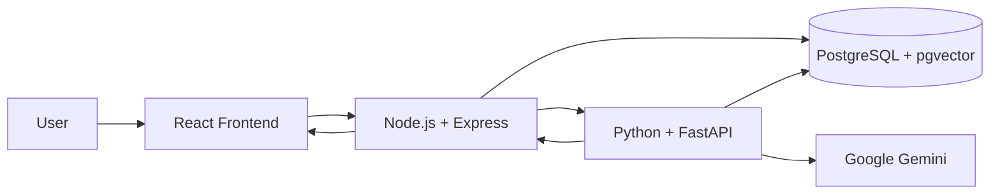

# Cognivault

### AI-Powered Multi-Project Document Analysis Platform

Cognivault is an AI-powered multi-project document analysis platform that allows users to organize documents by project and ask natural-language questions over their uploaded content. The system uses a Node.js application backend and a Python/FastAPI AI service to process documents, generate embeddings, retrieve relevant content using vector search, and generate responses with an LLM.


**GitHub Repository**: [https://github.com/nitin-code6/cognivault.git](https://github.com/nitin-code6/cognivault.git)

---

## Table of Contents
- [Project Overview](#project-overview)
- [Problem Statement](#problem-statement)
- [Solution](#solution)
- [Project Status](#project-status)
- [Key Features](#key-features)
- [Technology Stack](#technology-stack)
- [Why This Tech Stack?](#why-this-tech-stack)
- [System Architecture](#system-architecture)
- [RAG Pipeline](#rag-pipeline)
- [Agentic Routing](#agentic-routing)
- [Document Ingestion](#document-ingestion)
- [Environment Variables](#environment-variables)
- [Installation & Running Locally](#installation--running-locally)
- [API Documentation](#api-documentation)
- [Limitations](#limitations)
- [Interview Reference](#interview-reference)

---

## Project Overview

Information is often distributed across various documents within an organization. Keyword search can make semantic questions difficult to answer, and sending entire documents to an LLM can increase context size and token usage unnecessarily. 

Cognivault provides an interface for users to upload PDF documents and query them. It utilizes Retrieval-Augmented Generation (RAG) to fetch only the most relevant document chunks to ground the LLM's response, reducing the amount of document content sent to the LLM compared with passing an entire document.

---

## Problem Statement

Project information is often scattered across PDF reports, specifications, and policies. Relying on manual search is inefficient. Conversely, providing an entire 500-page document to a Large Language Model is expensive and often exceeds context limits. RAG provides a way to retrieve relevant content before generation, ensuring the LLM only operates on relevant context.

---

## Solution

Cognivault addresses this through a modular pipeline:

### Document Ingestion
`Document` → `Text Extraction (PyPDF2)` → `Fixed-Size Chunking` → `Embedding (Google GenAI)` → `Vector Storage (pgvector)`

### Query Answering
`Question` → `LLM Router` → `Query Embedding` → `Vector Search` → `Top-3 Relevant Chunks` → `Prompt Construction` → `Gemini LLM` → `Answer`

---

## Project Status

| Area | Status |
|------|--------|
| Backend API (Node.js) | ✅ Implemented |
| Frontend UI (React + Vite) | ✅ Implemented |
| Document Ingestion (PDF) | ✅ Implemented |
| Chunking (Fixed-Size) | ✅ Implemented |
| Embeddings (`text-embedding-004`) | ✅ Implemented |
| Vector Database (`pgvector`) | ✅ Implemented |
| RAG Retrieval Pipeline | ✅ Implemented |
| LLM Integration (`gemini-2.5-flash`) | ✅ Implemented |
| LLM-Based Query Router | ✅ Implemented |
| Conversation Memory | ✅ Implemented |
| Basic Input Guardrails | ✅ Implemented |
| Docker Containerization | ✅ Implemented |
| Automated Evaluation Script | ✅ Implemented |
| Pytest Unit Testing | ✅ Implemented |
| Source Citations | 🔄 In Progress |
| Redis Caching | ⏳ Planned |
| Response Streaming | ⏳ Planned |

---

## Key Features

| Feature | Description | Status |
|---------|-------------|--------|
| **Vector Search** | Retrieves document chunks based on cosine similarity using `pgvector`. | ✅ Implemented |
| **LLM-Based Query Router** | Uses Gemini to classify user intent, routing queries to RAG search, internal Tool execution, or general chat. | ✅ Implemented |
| **Input Guardrails** | A Node.js middleware checks input arrays against known prompt-injection patterns before forwarding to the AI service. | ✅ Implemented |
| **Automated Evaluation** | An included script uses the LLM to inspect generated responses for relevance and faithfulness. | ✅ Implemented |
| **Containerization** | The application services and database are configured to run via a single `docker-compose.yml`. | ✅ Implemented |

---

## Technology Stack

| Layer | Technology | Responsibility |
|-------|------------|----------------|
| **Frontend** | React + Vite + Tailwind 4 | User interface |
| **Application Backend** | Node.js + Express | API Gateway, input validation, guardrails |
| **AI Service** | Python + FastAPI | AI processing, orchestration, and embeddings |
| **Database** | PostgreSQL | Structured application data |
| **Vector Search** | pgvector | Semantic retrieval via cosine similarity |
| **AI Provider** | Google GenAI SDK | Embeddings (`text-embedding-004`) + LLM (`gemini-2.5-flash`) |
| **Containerization** | Docker | Local reproducible environment |
| **Testing** | pytest | Python service unit testing |

---

## Why This Tech Stack?

### Node.js + Express
Used for the application API and communication between the frontend and Python AI service. Node.js provides an asynchronous application layer suitable for handling API and I/O operations (like proxying file uploads via `multer`).

### Python + FastAPI
Used for AI-specific processing because the Python ecosystem provides direct access to document-processing libraries (`PyPDF2`) and native GenAI SDKs. FastAPI handles data validation via Pydantic.

### PostgreSQL + pgvector
Used to keep structured application data and vector embeddings within the same database system. `pgvector` allows vector similarity search to be performed within PostgreSQL, reducing the need for a separate vector database for the current project. A dedicated vector database may be considered if retrieval requirements or dataset size grow significantly.

### Docker
Used to provide consistent local environments for the application services and dependencies, ensuring PostgreSQL and the microservices spin up predictably.

---

## System Architecture



---

## RAG Pipeline

### What is RAG?
Retrieval-Augmented Generation (RAG) combines information retrieval with language generation.

### Cognivault RAG Flow
1. **Query**: User asks a question.
2. **Embedding**: The text is converted into a 768-dimensional vector using `text-embedding-004`.
3. **Vector Search**: The system performs a cosine similarity search against `pgvector` to find the nearest vectors.
4. **Top-K Chunks**: The top 3 closest chunks are retrieved.
5. **Prompt**: The chunks and conversation history are combined into a prompt.
6. **LLM**: `gemini-2.5-flash` generates a response grounded in the provided context.

### RAG vs Fine-Tuning

| RAG | Fine-Tuning |
|-----|-------------|
| Retrieves external knowledge | Changes model behavior |
| Good for frequently changing documents | Useful for behavior/style/task adaptation |
| Knowledge remains outside model | Knowledge may be encoded during training |
| Requires retrieval pipeline | Requires training/fine-tuning pipeline |

---

## Agentic Routing

An LLM-based query router evaluates the incoming user message to classify intent. It determines whether to:
- Use **RAG** to search the document database.
- Use a **Tool** (e.g., executing a local Python function to retrieve employee details).
- Answer **Generally** without external context.

This is a controlled workflow designed to bypass unnecessary vector searches when a user is merely greeting the system or asking for a specific programmatic lookup.

---

## Document Ingestion

When a PDF is uploaded, `PyPDF2` extracts the text. The text is split using **fixed-size chunking** (500 characters with a 50-character overlap). Overlap ensures that sentences at chunk boundaries retain their semantic context. The chunks are then embedded and saved to PostgreSQL.

---

## Environment Variables

Copy `.env.example` to `.env` and fill in the values.

```env
# Application Layer
PORT=3000
AI_SERVICE_URL=http://ai-service:8000

# AI Layer
LLM_API_KEY=your_google_gemini_api_key_here
DATABASE_URL=postgresql://user:password@db:5432/cognivault
```

---

## Installation & Running Locally

The easiest way to run the platform is via Docker.

1. Clone the repository:
   ```bash
   git clone https://github.com/nitin-code6/cognivault.git
   cd cognivault
   ```
2. Create and configure your `.env` file.
3. Start the cluster:
   ```bash
   docker-compose up --build
   ```
4. Access the UI at `http://localhost:5173`.

---

## API Documentation

### Node.js Gateway

| Method | Endpoint | Description |
|--------|----------|-------------|
| GET | `/health` | Gateway health check |
| POST | `/api/chat` | Receives chat messages, performs guardrail checks, proxies to AI Service |
| POST | `/api/documents/upload` | Receives multipart form data, proxies file to AI service |

### AI Service (Python)

| Method | Endpoint | Description |
|--------|----------|-------------|
| GET | `/health` | AI Service health check |
| POST | `/api/chat` | Accepts `{ message, filter_filename, history }`. Routes query and returns response. |
| POST | `/api/documents/upload` | Accepts PDF file, chunks text, embeds, and stores in DB. |

---

## Limitations

- Supported document formats are currently limited to PDF.
- Retrieval quality heavily depends on fixed-size chunking boundaries; semantic boundary detection is not yet implemented.
- LLM responses remain probabilistic; users must verify critical information.
- The prompt injection middleware relies on strict string matching ("ignore all previous instructions") and is not a comprehensive security solution.
- Redis caching and response streaming are planned but not yet active.

---

## Interview Reference

### How I Explain Cognivault

"I built Cognivault as a multi-project document analysis platform using a React frontend, Node.js application backend, and Python/FastAPI AI service. Documents are processed into fixed-size chunks, converted into embeddings, and stored in PostgreSQL using pgvector for vector retrieval. When a user asks a question, an LLM-based router decides whether to search the knowledge base. If RAG is selected, the system retrieves the top 3 relevant document contexts via cosine similarity and provides them to Gemini to generate a grounded response. I separated the application and AI services so that the general backend logic and security guardrails remain independent from the Python-based GenAI pipeline."

### Common Interview Questions

1. **Why RAG instead of fine-tuning?**
   RAG keeps the knowledge external, meaning documents can be updated or deleted from the database instantly without retraining the model. It also reduces hallucinations by explicitly injecting context into the prompt.
2. **Why use embeddings?**
   Embeddings convert text into numerical vectors that capture semantic meaning. This allows the system to find conceptually relevant information even if the exact keywords don't match.
3. **Why pgvector?**
   It allows vector similarity search to be performed directly within PostgreSQL, preventing the need to deploy and manage a separate dedicated vector database for early-stage development.
4. **Why Node + Python?**
   Node.js handles asynchronous I/O and web traffic efficiently, acting as a gateway and security layer. Python provides direct access to native GenAI libraries, `PyPDF2`, and data science tooling.
5. **How does chunking work?**
   Documents are split into 500-character segments with a 50-character overlap. The overlap ensures context isn't lost if a sentence is split across two chunks.
6. **What does top-k mean?**
   Top-k refers to the number of closest vector matches retrieved from the database during a similarity search (in this implementation, k=3).
7. **How is prompt injection handled?**
   The Node.js gateway inspects the incoming request array for known malicious patterns before forwarding it to the AI service, providing an initial layer of defense.
8. **What happens if the AI service fails?**
   The Node.js backend catches the timeout or 500 error and returns a graceful error message to the frontend without crashing the application layer.
