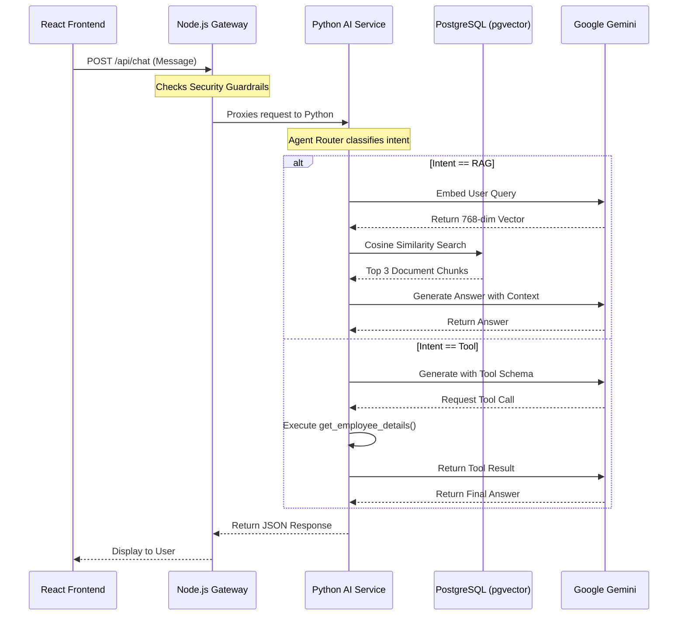

# Cognivault

**Cognivault** is an Enterprise GenAI Knowledge & Operations Platform designed to process documents, extract intelligence, and provide a conversational interface for enterprise data using Retrieval-Augmented Generation (RAG).

## 🏗️ Architecture & File Structure

Cognivault uses a modern microservices architecture to strictly separate the user interface, business logic, and heavy AI/data processing workloads.

```text
cognivault/
├── frontend/             # React (Vite + TailwindCSS)
│                         # Handles the User Interface
├── backend/              # Node.js + Express
│                         # API Gateway, Security Guardrails, File Proxies
├── ai-service/           # Python (FastAPI + GenAI SDK)
│                         # LLM, Vector Search, Chunking, RAG Pipeline
├── docker-compose.yml    # Runs PostgreSQL + pgvector
├── .env.example          # Environment variables template
└── .gitignore            # Security policies (no secrets committed)
```

## 🔄 System Flow (Mermaid Diagram)



## 🚀 Features Implemented
1. **Document Ingestion**: Upload PDFs, extract text, and chunk data seamlessly.
2. **Semantic Search**: Powered by Google's `text-embedding-004` and PostgreSQL `pgvector`.
3. **Agentic Router**: Intelligently routes queries between RAG pipelines and internal Tool calls.
4. **Security**: Node.js actively intercepts and drops prompt injection attacks before they hit the LLM.
5. **Conversational Memory**: Supports multi-turn conversations by passing session history.

## 🛠️ How to Run Locally

1. **Start the Vector Database**
   ```bash
   docker-compose up -d
   ```
2. **Start the Python AI Service**
   ```bash
   cd ai-service
   python -m venv .venv
   .\.venv\Scripts\activate.bat
   pip install -r requirements.txt
   uvicorn main:app --port 8000
   ```
3. **Start the Node API Gateway**
   ```bash
   cd backend
   npm install
   node index.js
   ```
4. **Start the React Frontend**
   ```bash
   cd frontend
   npm install
   npm run dev
   ```

## ⚠️ Security
Never commit `.env` files. Ensure you copy `.env.example` to `.env` and fill in your real `LLM_API_KEY`.
